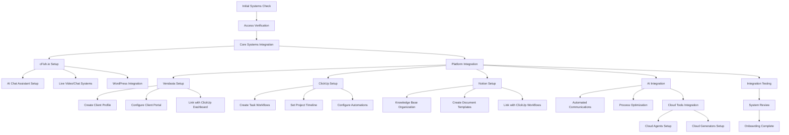

# UcFish Onboarding Process Map

This process map illustrates the complete UcFish onboarding workflow, from initial system verification through full platform integration and testing. Each step represents a critical component of the onboarding process, ensuring proper setup across cFish.io, Vendasta, ClickUp, and Notion platforms with integrated AI and cloud tools. 