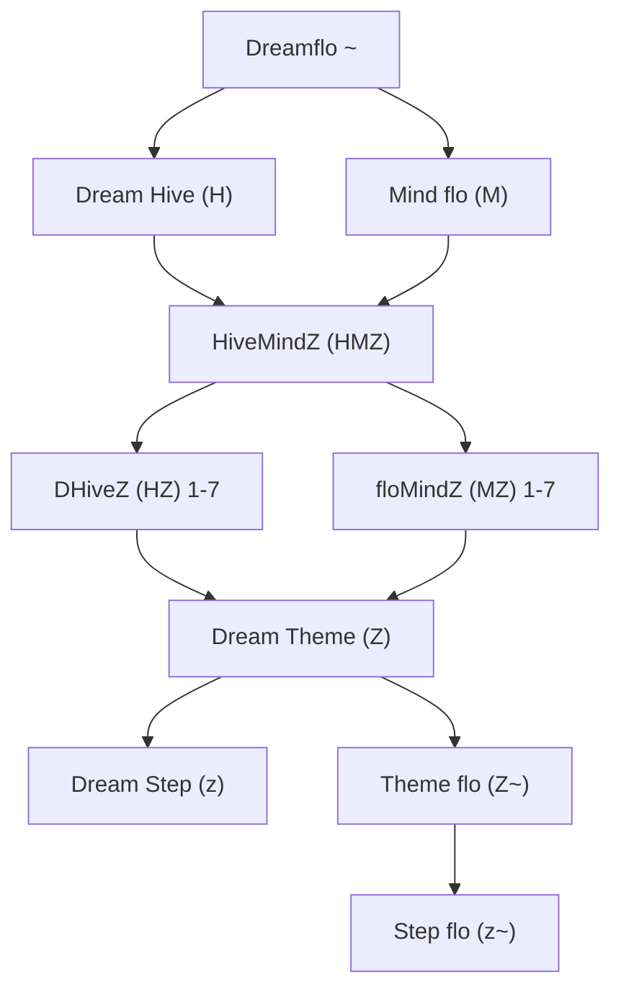
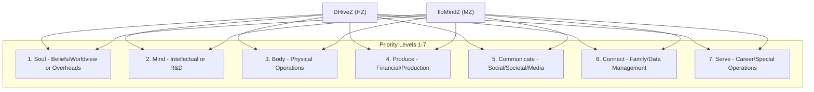
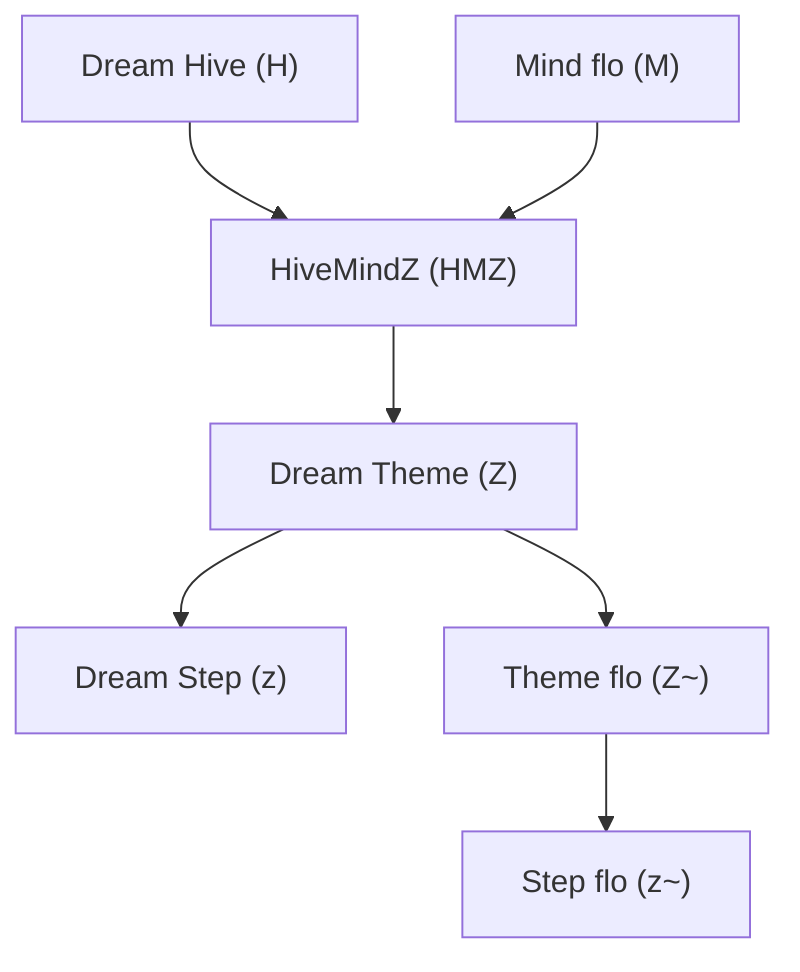
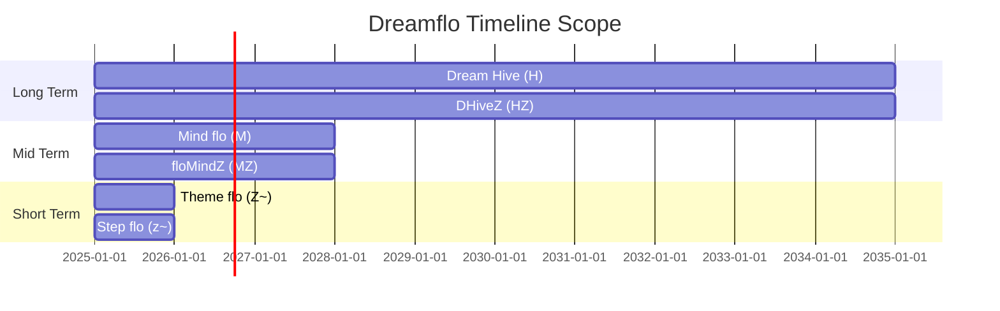

# Dreamflo System Visual Diagrams

## 1. Overall System Hierarchy

## 2. HiveMindZ Priority Structure

## 3. Goal Flow Process

## 4. Daily Workflow Matrix

| **Time** | **Activity** | **Components** |
| --- | --- | --- |
| Morning | Planning | Dream Theme (Z) + Theme flo (Z~) |
| Midday | Execution | Dream Step (z) + Step flo (z~) |
| Evening | Review | HMZ GoalZ alignment check |
| Weekly | Strategy | Dream Hive (H) + Mind flo (M) review |

## 5. Timeline Visualization

