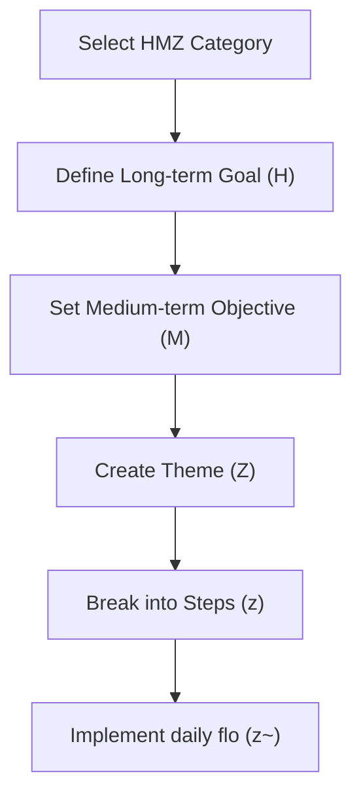

# Dreamflo Training Workshop Materials

## Hands-on Exercise Diagrams

### Exercise 1: HMZ Goal Setting

### Exercise 2: Personal vs Business Matrix

| **HMZ Level** | **Personal Example** | **Business Example** |
| --- | --- | --- |
| Soul (1) | Personal values definition | Company culture development |
| Mind (2) | Skill development plan | R&D strategy |
| Body (3) | Health routine | Operations workflow |
| Produce (4) | Personal finance goals | Revenue targets |
| Communicate (5) | Relationship building | Marketing strategy |
| Connect (6) | Family time management | Data management systems |
| Serve (7) | Career development | Special operations |

## Breakout Group Discussion Guides

- Session 1: Dream Hive Exploration
    - Discuss your 5-10 year vision within each HMZ category
    - Share potential challenges and solutions
    - Identify key milestones for each goal
- Session 2: Mind flo Implementation
    - Review current 1-3 year priorities
    - Analyze alignment with Dream Hive goals
    - Develop action plans for immediate execution
- Session 3: Theme and Step Development
    - Create Dream Themes (Z) for current quarter
    - Define corresponding Theme flo (Z~)
    - Break down into actionable Dream Steps (z)
    - Establish daily Step flo (z~) routines

## Progress Tracking Template

| **Component** | **Target** | **Current Status** |
| --- | --- | --- |
| Session Execution | 90-95% | Track efficiency |
| Goal Achievement | 85-90% | Monitor progress |
| Documentation | 85-90% | Measure accuracy |
| System Effectiveness | 85-90% | Assess optimization | 