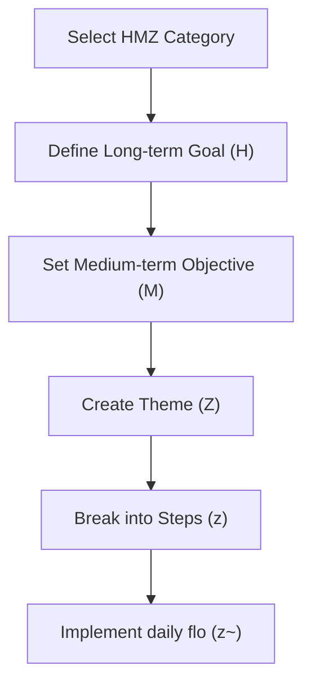

# Dreamflo ~ Workshop Materials

This comprehensive document contains all materials needed to conduct effective Dreamflo training workshops, including exercises, discussion guides, icebreakers, and progress tracking templates.

## Workshop Series Overview

### Workshop 1: Understanding Core Concepts
- Introduction to Dreamflo terminology and structure
- Exploring the seven HiveMindZ pillars
- Connecting Dream Hive to Mind flo

### Workshop 2: Personal Implementation
- Creating your personal Dream Hive
- Developing your Mind flo priorities
- Establishing your HiveMindZ structure

### Workshop 3: Business Implementation
- Adapting Dreamflo for organizational use
- Departmental integration strategies
- Cross-functional alignment techniques

### Workshop 4: Daily Implementation
- Morning planning routines
- Midday execution strategies
- Evening review processes

## Hands-on Exercise Diagrams

### Exercise 1: HMZ Goal Setting

### Exercise 2: Personal vs Business Matrix

| **HMZ Level** | **Personal Example** | **Business Example** |
| --- | --- | --- |
| Soul (1) | Personal values definition | Company culture development |
| Mind (2) | Skill development plan | R&D strategy |
| Body (3) | Health routine | Operations workflow |
| Produce (4) | Personal finance goals | Revenue targets |
| Communicate (5) | Relationship building | Marketing strategy |
| Connect (6) | Family time management | Data management systems |
| Serve (7) | Career development | Special operations |

## Breakout Group Discussion Guides

- Session 1: Dream Hive Exploration
    - Discuss your 5-10 year vision within each HMZ category
    - Share potential challenges and solutions
    - Identify key milestones for each goal
- Session 2: Mind flo Implementation
    - Review current 1-3 year priorities
    - Analyze alignment with Dream Hive goals
    - Develop action plans for immediate execution
- Session 3: Theme and Step Development
    - Create Dream Themes (Z) for current quarter
    - Define corresponding Theme flo (Z~)
    - Break down into actionable Dream Steps (z)
    - Establish daily Step flo (z~) routines

## Icebreakers and Interactive Activities

### Dreamflo Educational Icebreakers

1. **Symbol Matching Game**
   - Participants match Dreamflo symbols with their definitions
   - Time limit: 3 minutes
   - Discuss results and clarify any confusion

2. **HMZ Category Brainstorm**
   - In small groups, brainstorm examples for each HMZ category
   - Share the most creative examples with the larger group
   - Discuss how different categories interconnect

3. **Vision Timeline Exercise**
   - Create a visual timeline from Dream Hive to daily Step flo
   - Mark key decision points and review cycles
   - Present your timeline to a partner for feedback

### UcFish Organization Icebreakers

1. **Department HMZ Mapping**
   - Each department identifies their primary HMZ categories
   - Discuss areas of overlap and collaboration
   - Create a visual map of organizational HMZ structure

2. **Cross-Functional Theme Development**
   - Mixed department groups develop shared Dream Themes
   - Identify how each department contributes to the theme
   - Present collaborative implementation strategies

3. **Success Metrics Challenge**
   - Teams compete to develop the most comprehensive metrics
   - Focus on measurable outcomes for each HMZ category
   - Vote on the most effective measurement framework

### Interactive AI Workshop Icebreakers

1. **AI-Assisted Goal Refinement**
   - Use AI tools to refine personal or business goals
   - Compare AI suggestions with manual approaches
   - Discuss how AI can enhance Dreamflo implementation

2. **Automated Alignment Check**
   - Demonstrate AI tools for checking goal alignment
   - Practice using alignment verification techniques
   - Discuss potential automation of routine Dreamflo tasks

3. **Future Vision Exploration**
   - AI generates potential future scenarios based on goals
   - Discuss implications and adjust Dream Hive accordingly
   - Identify how AI can support long-term vision development

## Progress Tracking Template

| **Component** | **Target** | **Current Status** |
| --- | --- | --- |
| Session Execution | 90-95% | Track efficiency |
| Goal Achievement | 85-90% | Monitor progress |
| Documentation | 85-90% | Measure accuracy |
| System Effectiveness | 85-90% | Assess optimization |

## Workshop Facilitation Guidelines

1. **Preparation**
   - Review all materials before the workshop
   - Customize examples for your specific audience
   - Prepare visual aids and handouts

2. **Facilitation**
   - Begin with icebreakers to establish comfort
   - Alternate between instruction and hands-on activities
   - Use real-world examples relevant to participants

3. **Follow-up**
   - Provide resources for continued learning
   - Schedule check-in sessions for implementation support
   - Create a feedback loop for continuous improvement

_Updated 03-13-2025 | AI: Cursor (Claude 3.7 Sonnet)_ 